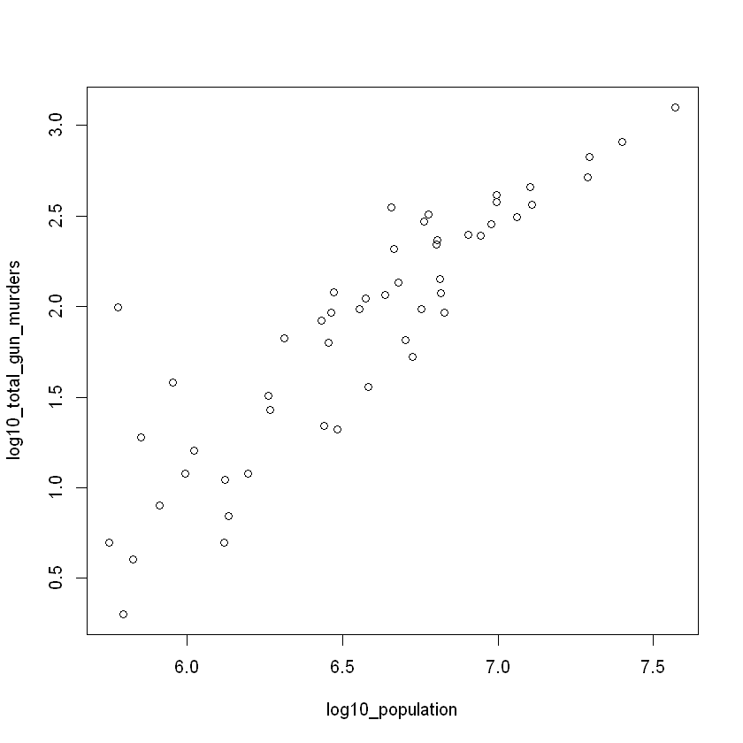

# US Gun Homicides Data Analysis

Use R Programming to analyze the gun homicides data in the US. Answer the question like how safe each state is.


```R
# For Using this package install this package using install.packages("dslabs")
library(dslabs)
```


```R
# For Using this package install this package using install.packages("dplyr")
library(dplyr)
```

    
    Attaching package: 'dplyr'
    
    The following objects are masked from 'package:stats':
    
        filter, lag
    
    The following objects are masked from 'package:base':
    
        intersect, setdiff, setequal, union
    
    

## Data Acquire

This "murders" data frame provide a data of the state name, the abbreviation of the state name, the state's region, and the state's population and the total number of murders for 2010.


```R
data("murders")
```

## Data Prepare

### Data Explore & Visualization


```R
# Check the structure of the murders data
str(murders)
```

    'data.frame':	51 obs. of  5 variables:
     $ state     : chr  "Alabama" "Alaska" "Arizona" "Arkansas" ...
     $ abb       : chr  "AL" "AK" "AZ" "AR" ...
     $ region    : Factor w/ 4 levels "Northeast","South",..: 2 4 4 2 4 4 1 2 2 2 ...
     $ population: num  4779736 710231 6392017 2915918 37253956 ...
     $ total     : num  135 19 232 93 1257 ...
    


```R
# Check the levels in region
levels(murders$region)
```


<ol class=list-inline>
	<li>'Northeast'</li>
	<li>'South'</li>
	<li>'North Central'</li>
	<li>'West'</li>
</ol>


```R
table(murders$region)
```


    
        Northeast         South North Central          West 
                9            17            12            13 


```R
# Rank the states from least to most gun homicides cases
totals <- murders$total
total_index <- order(totals)
murders$state[total_index]
```


<ol class=list-inline>
	<li>'Vermont'</li>
	<li>'North Dakota'</li>
	<li>'New Hampshire'</li>
	<li>'Wyoming'</li>
	<li>'Hawaii'</li>
	<li>'South Dakota'</li>
	<li>'Maine'</li>
	<li>'Idaho'</li>
	<li>'Montana'</li>
	<li>'Rhode Island'</li>
	<li>'Alaska'</li>
	<li>'Iowa'</li>
	<li>'Utah'</li>
	<li>'West Virginia'</li>
	<li>'Nebraska'</li>
	<li>'Oregon'</li>
	<li>'Delaware'</li>
	<li>'Minnesota'</li>
	<li>'Kansas'</li>
	<li>'Colorado'</li>
	<li>'New Mexico'</li>
	<li>'Nevada'</li>
	<li>'Arkansas'</li>
	<li>'Washington'</li>
	<li>'Connecticut'</li>
	<li>'Wisconsin'</li>
	<li>'District of Columbia'</li>
	<li>'Oklahoma'</li>
	<li>'Kentucky'</li>
	<li>'Massachusetts'</li>
	<li>'Mississippi'</li>
	<li>'Alabama'</li>
	<li>'Indiana'</li>
	<li>'South Carolina'</li>
	<li>'Tennessee'</li>
	<li>'Arizona'</li>
	<li>'New Jersey'</li>
	<li>'Virginia'</li>
	<li>'North Carolina'</li>
	<li>'Maryland'</li>
	<li>'Ohio'</li>
	<li>'Missouri'</li>
	<li>'Louisiana'</li>
	<li>'Illinois'</li>
	<li>'Georgia'</li>
	<li>'Michigan'</li>
	<li>'Pennsylvania'</li>
	<li>'New York'</li>
	<li>'Florida'</li>
	<li>'Texas'</li>
	<li>'California'</li>
</ol>


```R
# Rank the state by least to most population
populations <- murders$population
population_index <- order(populations)
murders$state[population_index]
```


<ol class=list-inline>
	<li>'Wyoming'</li>
	<li>'District of Columbia'</li>
	<li>'Vermont'</li>
	<li>'North Dakota'</li>
	<li>'Alaska'</li>
	<li>'South Dakota'</li>
	<li>'Delaware'</li>
	<li>'Montana'</li>
	<li>'Rhode Island'</li>
	<li>'New Hampshire'</li>
	<li>'Maine'</li>
	<li>'Hawaii'</li>
	<li>'Idaho'</li>
	<li>'Nebraska'</li>
	<li>'West Virginia'</li>
	<li>'New Mexico'</li>
	<li>'Nevada'</li>
	<li>'Utah'</li>
	<li>'Kansas'</li>
	<li>'Arkansas'</li>
	<li>'Mississippi'</li>
	<li>'Iowa'</li>
	<li>'Connecticut'</li>
	<li>'Oklahoma'</li>
	<li>'Oregon'</li>
	<li>'Kentucky'</li>
	<li>'Louisiana'</li>
	<li>'South Carolina'</li>
	<li>'Alabama'</li>
	<li>'Colorado'</li>
	<li>'Minnesota'</li>
	<li>'Wisconsin'</li>
	<li>'Maryland'</li>
	<li>'Missouri'</li>
	<li>'Tennessee'</li>
	<li>'Arizona'</li>
	<li>'Indiana'</li>
	<li>'Massachusetts'</li>
	<li>'Washington'</li>
	<li>'Virginia'</li>
	<li>'New Jersey'</li>
	<li>'North Carolina'</li>
	<li>'Michigan'</li>
	<li>'Georgia'</li>
	<li>'Ohio'</li>
	<li>'Pennsylvania'</li>
	<li>'Illinois'</li>
	<li>'New York'</li>
	<li>'Florida'</li>
	<li>'Texas'</li>
	<li>'California'</li>
</ol>


```R
# Calculate the murders per capita
murder_rate <- murders$total/murders$population*100000
```


```R
# Rank the state by most to least murder rate
murders$state[order(murder_rate, decreasing = TRUE)]
```


<ol class=list-inline>
	<li>'District of Columbia'</li>
	<li>'Louisiana'</li>
	<li>'Missouri'</li>
	<li>'Maryland'</li>
	<li>'South Carolina'</li>
	<li>'Delaware'</li>
	<li>'Michigan'</li>
	<li>'Mississippi'</li>
	<li>'Georgia'</li>
	<li>'Arizona'</li>
	<li>'Pennsylvania'</li>
	<li>'Tennessee'</li>
	<li>'Florida'</li>
	<li>'California'</li>
	<li>'New Mexico'</li>
	<li>'Texas'</li>
	<li>'Arkansas'</li>
	<li>'Virginia'</li>
	<li>'Nevada'</li>
	<li>'North Carolina'</li>
	<li>'Oklahoma'</li>
	<li>'Illinois'</li>
	<li>'Alabama'</li>
	<li>'New Jersey'</li>
	<li>'Connecticut'</li>
	<li>'Ohio'</li>
	<li>'Alaska'</li>
	<li>'Kentucky'</li>
	<li>'New York'</li>
	<li>'Kansas'</li>
	<li>'Indiana'</li>
	<li>'Massachusetts'</li>
	<li>'Nebraska'</li>
	<li>'Wisconsin'</li>
	<li>'Rhode Island'</li>
	<li>'West Virginia'</li>
	<li>'Washington'</li>
	<li>'Colorado'</li>
	<li>'Montana'</li>
	<li>'Minnesota'</li>
	<li>'South Dakota'</li>
	<li>'Oregon'</li>
	<li>'Wyoming'</li>
	<li>'Maine'</li>
	<li>'Utah'</li>
	<li>'Idaho'</li>
	<li>'Iowa'</li>
	<li>'North Dakota'</li>
	<li>'Hawaii'</li>
	<li>'New Hampshire'</li>
	<li>'Vermont'</li>
</ol>


```R
# Calculate the average murder rate in the US
us_murder_rate <- mean(murder_rate)
```


```R
us_murder_rate
```


2.77912545066711


```R
# Find out which state has a murder rate less then 1
low <- murder_rate < 1
murders$state[low]
```


<ol class=list-inline>
	<li>'Hawaii'</li>
	<li>'Idaho'</li>
	<li>'Iowa'</li>
	<li>'Maine'</li>
	<li>'Minnesota'</li>
	<li>'New Hampshire'</li>
	<li>'North Dakota'</li>
	<li>'Oregon'</li>
	<li>'South Dakota'</li>
	<li>'Utah'</li>
	<li>'Vermont'</li>
	<li>'Wyoming'</li>
</ol>


```R
# Find out which state in the West region has a murder rate at most 1
west <- murders$region == "West"
safe <- murder_rate <= 1
west_safe_index <- safe & west
murders$state[west_safe_index]
```


<ol class=list-inline>
	<li>'Hawaii'</li>
	<li>'Idaho'</li>
	<li>'Oregon'</li>
	<li>'Utah'</li>
	<li>'Wyoming'</li>
</ol>


```R
# Find out which state in the Northeast region has a murder rate lower than 1
northeast <- murders$region == "Northeast" & murder_rate < 1
murders$state[northeast]
```


<ol class=list-inline>
	<li>'Maine'</li>
	<li>'New Hampshire'</li>
	<li>'Vermont'</li>
</ol>


```R
# How many state are below the average murder rate
sum(murder_rate < us_murder_rate)
```


27


```R
# Check out murder rate at "Massachusetts"
ma_index <- which(murders$state == "Massachusetts")
murder_rate[ma_index]
```


1.80217907886962


```R
# Find out the murder rate at New York, Florida, and Texas
ny_fl_tx_index <- match(c("New York", "Florida", "Texas"), murders$state)
murder_rate[ny_fl_tx_index]
```


<ol class=list-inline>
	<li>2.66795994778023</li>
	<li>3.39806883024604</li>
	<li>3.20136027189849</li>
</ol>


```R
# Find out if Boston, Dakota and Washington are state or not
c("Boston", "Dakota", "Washington") %in% murders$state
```


<ol class=list-inline>
	<li>FALSE</li>
	<li>FALSE</li>
	<li>TRUE</li>
</ol>


### Perform Data Cleaning


```R
# add murder rate to the murders data frame
murders <- mutate(murders, rate = murder_rate)
```


```R
# Find out which state has a murder rate below 0.71
murders %>%
    select(state, region, rate) %>%
    filter(rate <= 0.71)
```


<table>
<thead><tr><th scope=col>state</th><th scope=col>region</th><th scope=col>rate</th></tr></thead>
<tbody>
	<tr><td>Hawaii       </td><td>West         </td><td>0.5145920    </td></tr>
	<tr><td>Iowa         </td><td>North Central</td><td>0.6893484    </td></tr>
	<tr><td>New Hampshire</td><td>Northeast    </td><td>0.3798036    </td></tr>
	<tr><td>North Dakota </td><td>North Central</td><td>0.5947151    </td></tr>
	<tr><td>Vermont      </td><td>Northeast    </td><td>0.3196211    </td></tr>
</tbody>
</table>


```R
# Add a column named rank with the ranks of rate from highest to lowest
murders <- mutate(murders, rank = rank(-rate))
```


```R
# Filter to show the top 5 states with the highest murder rates
filter(murders, rank < 6)
```


<table>
<thead><tr><th scope=col>state</th><th scope=col>abb</th><th scope=col>region</th><th scope=col>population</th><th scope=col>total</th><th scope=col>rate</th><th scope=col>rank</th></tr></thead>
<tbody>
	<tr><td>District of Columbia</td><td>DC                  </td><td>South               </td><td> 601723             </td><td> 99                 </td><td>16.452753           </td><td>1                   </td></tr>
	<tr><td>Louisiana           </td><td>LA                  </td><td>South               </td><td>4533372             </td><td>351                 </td><td> 7.742581           </td><td>2                   </td></tr>
	<tr><td>Maryland            </td><td>MD                  </td><td>South               </td><td>5773552             </td><td>293                 </td><td> 5.074866           </td><td>4                   </td></tr>
	<tr><td>Missouri            </td><td>MO                  </td><td>North Central       </td><td>5988927             </td><td>321                 </td><td> 5.359892           </td><td>3                   </td></tr>
	<tr><td>South Carolina      </td><td>SC                  </td><td>South               </td><td>4625364             </td><td>207                 </td><td> 4.475323           </td><td>5                   </td></tr>
</tbody>
</table>


```R
# remove states from the south region
filter(murders, region != "South")
```


<table>
<thead><tr><th scope=col>state</th><th scope=col>abb</th><th scope=col>region</th><th scope=col>population</th><th scope=col>total</th><th scope=col>rate</th><th scope=col>rank</th></tr></thead>
<tbody>
	<tr><td>Alaska       </td><td>AK           </td><td>West         </td><td>  710231     </td><td>  19         </td><td>2.6751860    </td><td>27           </td></tr>
	<tr><td>Arizona      </td><td>AZ           </td><td>West         </td><td> 6392017     </td><td> 232         </td><td>3.6295273    </td><td>10           </td></tr>
	<tr><td>California   </td><td>CA           </td><td>West         </td><td>37253956     </td><td>1257         </td><td>3.3741383    </td><td>14           </td></tr>
	<tr><td>Colorado     </td><td>CO           </td><td>West         </td><td> 5029196     </td><td>  65         </td><td>1.2924531    </td><td>38           </td></tr>
	<tr><td>Connecticut  </td><td>CT           </td><td>Northeast    </td><td> 3574097     </td><td>  97         </td><td>2.7139722    </td><td>25           </td></tr>
	<tr><td>Hawaii       </td><td>HI           </td><td>West         </td><td> 1360301     </td><td>   7         </td><td>0.5145920    </td><td>49           </td></tr>
	<tr><td>Idaho        </td><td>ID           </td><td>West         </td><td> 1567582     </td><td>  12         </td><td>0.7655102    </td><td>46           </td></tr>
	<tr><td>Illinois     </td><td>IL           </td><td>North Central</td><td>12830632     </td><td> 364         </td><td>2.8369608    </td><td>22           </td></tr>
	<tr><td>Indiana      </td><td>IN           </td><td>North Central</td><td> 6483802     </td><td> 142         </td><td>2.1900730    </td><td>31           </td></tr>
	<tr><td>Iowa         </td><td>IA           </td><td>North Central</td><td> 3046355     </td><td>  21         </td><td>0.6893484    </td><td>47           </td></tr>
	<tr><td>Kansas       </td><td>KS           </td><td>North Central</td><td> 2853118     </td><td>  63         </td><td>2.2081106    </td><td>30           </td></tr>
	<tr><td>Maine        </td><td>ME           </td><td>Northeast    </td><td> 1328361     </td><td>  11         </td><td>0.8280881    </td><td>44           </td></tr>
	<tr><td>Massachusetts</td><td>MA           </td><td>Northeast    </td><td> 6547629     </td><td> 118         </td><td>1.8021791    </td><td>32           </td></tr>
	<tr><td>Michigan     </td><td>MI           </td><td>North Central</td><td> 9883640     </td><td> 413         </td><td>4.1786225    </td><td> 7           </td></tr>
	<tr><td>Minnesota    </td><td>MN           </td><td>North Central</td><td> 5303925     </td><td>  53         </td><td>0.9992600    </td><td>40           </td></tr>
	<tr><td>Missouri     </td><td>MO           </td><td>North Central</td><td> 5988927     </td><td> 321         </td><td>5.3598917    </td><td> 3           </td></tr>
	<tr><td>Montana      </td><td>MT           </td><td>West         </td><td>  989415     </td><td>  12         </td><td>1.2128379    </td><td>39           </td></tr>
	<tr><td>Nebraska     </td><td>NE           </td><td>North Central</td><td> 1826341     </td><td>  32         </td><td>1.7521372    </td><td>33           </td></tr>
	<tr><td>Nevada       </td><td>NV           </td><td>West         </td><td> 2700551     </td><td>  84         </td><td>3.1104763    </td><td>19           </td></tr>
	<tr><td>New Hampshire</td><td>NH           </td><td>Northeast    </td><td> 1316470     </td><td>   5         </td><td>0.3798036    </td><td>50           </td></tr>
	<tr><td>New Jersey   </td><td>NJ           </td><td>Northeast    </td><td> 8791894     </td><td> 246         </td><td>2.7980319    </td><td>24           </td></tr>
	<tr><td>New Mexico   </td><td>NM           </td><td>West         </td><td> 2059179     </td><td>  67         </td><td>3.2537239    </td><td>15           </td></tr>
	<tr><td>New York     </td><td>NY           </td><td>Northeast    </td><td>19378102     </td><td> 517         </td><td>2.6679599    </td><td>29           </td></tr>
	<tr><td>North Dakota </td><td>ND           </td><td>North Central</td><td>  672591     </td><td>   4         </td><td>0.5947151    </td><td>48           </td></tr>
	<tr><td>Ohio         </td><td>OH           </td><td>North Central</td><td>11536504     </td><td> 310         </td><td>2.6871225    </td><td>26           </td></tr>
	<tr><td>Oregon       </td><td>OR           </td><td>West         </td><td> 3831074     </td><td>  36         </td><td>0.9396843    </td><td>42           </td></tr>
	<tr><td>Pennsylvania </td><td>PA           </td><td>Northeast    </td><td>12702379     </td><td> 457         </td><td>3.5977513    </td><td>11           </td></tr>
	<tr><td>Rhode Island </td><td>RI           </td><td>Northeast    </td><td> 1052567     </td><td>  16         </td><td>1.5200933    </td><td>35           </td></tr>
	<tr><td>South Dakota </td><td>SD           </td><td>North Central</td><td>  814180     </td><td>   8         </td><td>0.9825837    </td><td>41           </td></tr>
	<tr><td>Utah         </td><td>UT           </td><td>West         </td><td> 2763885     </td><td>  22         </td><td>0.7959810    </td><td>45           </td></tr>
	<tr><td>Vermont      </td><td>VT           </td><td>Northeast    </td><td>  625741     </td><td>   2         </td><td>0.3196211    </td><td>51           </td></tr>
	<tr><td>Washington   </td><td>WA           </td><td>West         </td><td> 6724540     </td><td>  93         </td><td>1.3829942    </td><td>37           </td></tr>
	<tr><td>Wisconsin    </td><td>WI           </td><td>North Central</td><td> 5686986     </td><td>  97         </td><td>1.7056487    </td><td>34           </td></tr>
	<tr><td>Wyoming      </td><td>WY           </td><td>West         </td><td>  563626     </td><td>   5         </td><td>0.8871131    </td><td>43           </td></tr>
</tbody>
</table>


```R
# Show only state form northeast and west region
filter(murders, region %in% c("Northeast", "West"))
```


<table>
<thead><tr><th scope=col>state</th><th scope=col>abb</th><th scope=col>region</th><th scope=col>population</th><th scope=col>total</th><th scope=col>rate</th><th scope=col>rank</th></tr></thead>
<tbody>
	<tr><td>Alaska       </td><td>AK           </td><td>West         </td><td>  710231     </td><td>  19         </td><td>2.6751860    </td><td>27           </td></tr>
	<tr><td>Arizona      </td><td>AZ           </td><td>West         </td><td> 6392017     </td><td> 232         </td><td>3.6295273    </td><td>10           </td></tr>
	<tr><td>California   </td><td>CA           </td><td>West         </td><td>37253956     </td><td>1257         </td><td>3.3741383    </td><td>14           </td></tr>
	<tr><td>Colorado     </td><td>CO           </td><td>West         </td><td> 5029196     </td><td>  65         </td><td>1.2924531    </td><td>38           </td></tr>
	<tr><td>Connecticut  </td><td>CT           </td><td>Northeast    </td><td> 3574097     </td><td>  97         </td><td>2.7139722    </td><td>25           </td></tr>
	<tr><td>Hawaii       </td><td>HI           </td><td>West         </td><td> 1360301     </td><td>   7         </td><td>0.5145920    </td><td>49           </td></tr>
	<tr><td>Idaho        </td><td>ID           </td><td>West         </td><td> 1567582     </td><td>  12         </td><td>0.7655102    </td><td>46           </td></tr>
	<tr><td>Maine        </td><td>ME           </td><td>Northeast    </td><td> 1328361     </td><td>  11         </td><td>0.8280881    </td><td>44           </td></tr>
	<tr><td>Massachusetts</td><td>MA           </td><td>Northeast    </td><td> 6547629     </td><td> 118         </td><td>1.8021791    </td><td>32           </td></tr>
	<tr><td>Montana      </td><td>MT           </td><td>West         </td><td>  989415     </td><td>  12         </td><td>1.2128379    </td><td>39           </td></tr>
	<tr><td>Nevada       </td><td>NV           </td><td>West         </td><td> 2700551     </td><td>  84         </td><td>3.1104763    </td><td>19           </td></tr>
	<tr><td>New Hampshire</td><td>NH           </td><td>Northeast    </td><td> 1316470     </td><td>   5         </td><td>0.3798036    </td><td>50           </td></tr>
	<tr><td>New Jersey   </td><td>NJ           </td><td>Northeast    </td><td> 8791894     </td><td> 246         </td><td>2.7980319    </td><td>24           </td></tr>
	<tr><td>New Mexico   </td><td>NM           </td><td>West         </td><td> 2059179     </td><td>  67         </td><td>3.2537239    </td><td>15           </td></tr>
	<tr><td>New York     </td><td>NY           </td><td>Northeast    </td><td>19378102     </td><td> 517         </td><td>2.6679599    </td><td>29           </td></tr>
	<tr><td>Oregon       </td><td>OR           </td><td>West         </td><td> 3831074     </td><td>  36         </td><td>0.9396843    </td><td>42           </td></tr>
	<tr><td>Pennsylvania </td><td>PA           </td><td>Northeast    </td><td>12702379     </td><td> 457         </td><td>3.5977513    </td><td>11           </td></tr>
	<tr><td>Rhode Island </td><td>RI           </td><td>Northeast    </td><td> 1052567     </td><td>  16         </td><td>1.5200933    </td><td>35           </td></tr>
	<tr><td>Utah         </td><td>UT           </td><td>West         </td><td> 2763885     </td><td>  22         </td><td>0.7959810    </td><td>45           </td></tr>
	<tr><td>Vermont      </td><td>VT           </td><td>Northeast    </td><td>  625741     </td><td>   2         </td><td>0.3196211    </td><td>51           </td></tr>
	<tr><td>Washington   </td><td>WA           </td><td>West         </td><td> 6724540     </td><td>  93         </td><td>1.3829942    </td><td>37           </td></tr>
	<tr><td>Wyoming      </td><td>WY           </td><td>West         </td><td>  563626     </td><td>   5         </td><td>0.8871131    </td><td>43           </td></tr>
</tbody>
</table>


```R
# Find out state in the Northeast or West region and has a murder rate less than 1
filter(murders, (region %in% c("Northeast", "West") & (rate < 1)))
```


<table>
<thead><tr><th scope=col>state</th><th scope=col>abb</th><th scope=col>region</th><th scope=col>population</th><th scope=col>total</th><th scope=col>rate</th><th scope=col>rank</th></tr></thead>
<tbody>
	<tr><td>Hawaii       </td><td>HI           </td><td>West         </td><td>1360301      </td><td> 7           </td><td>0.5145920    </td><td>49           </td></tr>
	<tr><td>Idaho        </td><td>ID           </td><td>West         </td><td>1567582      </td><td>12           </td><td>0.7655102    </td><td>46           </td></tr>
	<tr><td>Maine        </td><td>ME           </td><td>Northeast    </td><td>1328361      </td><td>11           </td><td>0.8280881    </td><td>44           </td></tr>
	<tr><td>New Hampshire</td><td>NH           </td><td>Northeast    </td><td>1316470      </td><td> 5           </td><td>0.3798036    </td><td>50           </td></tr>
	<tr><td>Oregon       </td><td>OR           </td><td>West         </td><td>3831074      </td><td>36           </td><td>0.9396843    </td><td>42           </td></tr>
	<tr><td>Utah         </td><td>UT           </td><td>West         </td><td>2763885      </td><td>22           </td><td>0.7959810    </td><td>45           </td></tr>
	<tr><td>Vermont      </td><td>VT           </td><td>Northeast    </td><td> 625741      </td><td> 2           </td><td>0.3196211    </td><td>51           </td></tr>
	<tr><td>Wyoming      </td><td>WY           </td><td>West         </td><td> 563626      </td><td> 5           </td><td>0.8871131    </td><td>43           </td></tr>
</tbody>
</table>


```R
# See the summary of the new data frame
summary(murders)
```


        state               abb                      region     population      
     Length:51          Length:51          Northeast    : 9   Min.   :  563626  
     Class :character   Class :character   South        :17   1st Qu.: 1696962  
     Mode  :character   Mode  :character   North Central:12   Median : 4339367  
                                           West         :13   Mean   : 6075769  
                                                              3rd Qu.: 6636084  
                                                              Max.   :37253956  
         total             rate              rank     
     Min.   :   2.0   Min.   : 0.3196   Min.   : 1.0  
     1st Qu.:  24.5   1st Qu.: 1.2526   1st Qu.:13.5  
     Median :  97.0   Median : 2.6871   Median :26.0  
     Mean   : 184.4   Mean   : 2.7791   Mean   :26.0  
     3rd Qu.: 268.0   3rd Qu.: 3.3861   3rd Qu.:38.5  
     Max.   :1257.0   Max.   :16.4528   Max.   :51.0  


## Data Analysis


```R
# Which states, if any, have murder rates lower than 0.5?
ind <- which.min(murder_rate)
if(murder_rate[ind] < 0.5) {
    print(murders$state[ind])
} else {
    print("No state has murder rate that low")
}
```

    [1] "Vermont"
    


```R
# Which states, if any, have murder rates lower than 0.25?
ind <- which.min(murder_rate)
if(murder_rate[ind] < 0.25) {
    print(murders_rate$state[ind])
} else {
    print("No state has murder rate that low")
}
```

    [1] "No state has murder rate that low"
    

## Data Report


```R
# Find out the relationship between population and total gun murder
population_in_millions <- murders$population/10^6
total_gun_murders <- murders$total
plot(population_in_millions, total_gun_murders)
```


```R
# Find out the relationship between population and total gun murder in log10 base
log10_population <- log10(murders$population)
log10_total_gun_murders <- log10(murders$total)
plot(log10_population, log10_total_gun_murders)
```





```R
# Plot histograms for murder rate
hist(murders$rate)
```


```R
# Plot histograms for Population
hist(population_in_millions)
```


```R
# Box Plot for comparing murder rate for different regions
boxplot(rate~region, data = murders)
```


```R
# Create a boxplot of state populations by region for the murders dataset
boxplot(population~region, data = murders)
```


